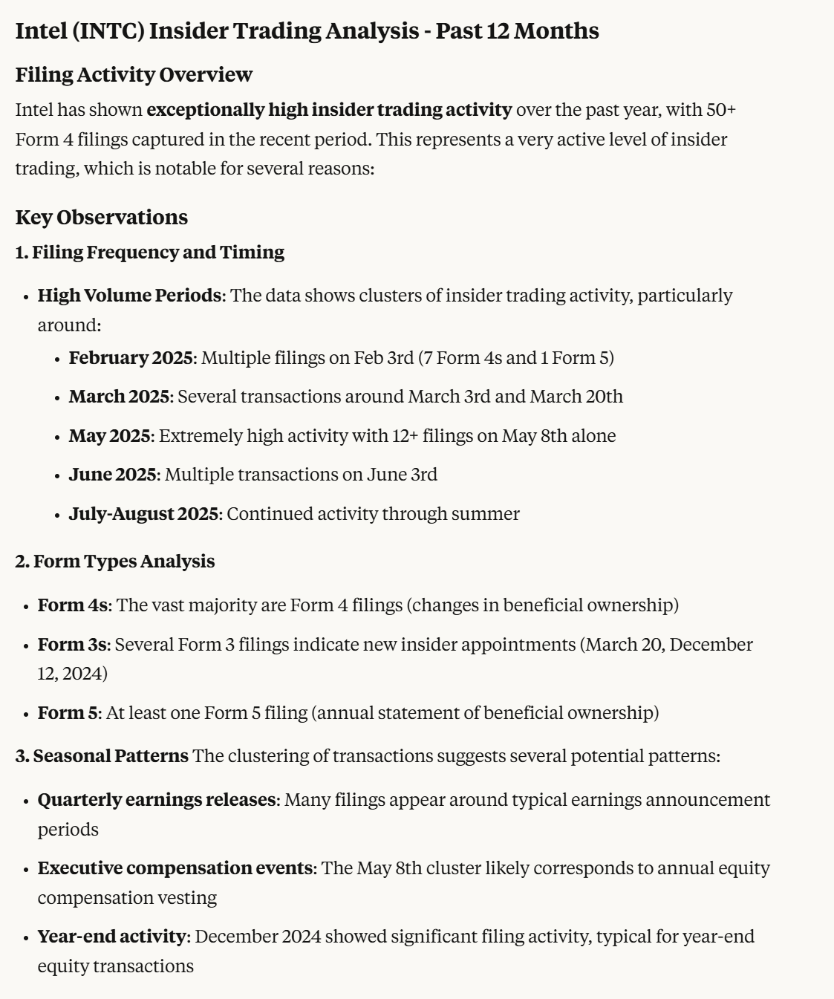

# form4mcp

MCP server for pulling SEC Form 4 Insider Trading data so an agent can summarize and do analysis about it.

## Usage Examples

```
Use form 4 mcp server to analyze the past year of insider trading for INTC
```


## SEC API Compliance

This server is fully compliant with the SEC's official API requirements:

- **User-Agent**: Uses SEC-required format: `Sample Company Name AdminContact@samplecompany.com`
- **Rate Limiting**: Respects SEC's 10 requests per second maximum
- **Endpoints**: Uses official SEC API endpoints:
  - Company search: `https://www.sec.gov/files/company_tickers.json`
  - Filings data: `https://data.sec.gov/submissions/CIK##########.json`

## Current Status

✅ **Company CIK Search**: Working - Returns company CIK numbers by ticker symbol
⚠️ **Insider Transactions**: May be blocked by SEC's enhanced security measures

The SEC's `data.sec.gov` domain has strict access controls that may block automated requests depending on:
- Geographic location
- IP address reputation  
- Previous request patterns
- Enhanced security policies

## Tools Available

1. `search_company_cik` - Find a company's CIK by ticker or name
2. `get_insider_transactions` - Get recent insider trading filings  
3. `parse_form4_filing` - Parse specific Form 4 filings
4. `get_executive_transactions` - Filter by executive roles
5. `analyze_insider_trends` - Analyze trading patterns

## Manual Alternative

If automated access is blocked, you can manually:
1. Use the search tool to get the company CIK
2. Visit `https://www.sec.gov/edgar/searchedgar/companysearch.html`
3. Search by CIK to find Form 4 filings
4. Use the parse tools on specific filing URLs

## References

- [SEC API Documentation](https://www.sec.gov/edgar/sec-api-documentation)
- [SEC Developer Resources](https://www.sec.gov/developer)
- [SEC Privacy and Security Policy](https://www.sec.gov/privacy.htm#security)
